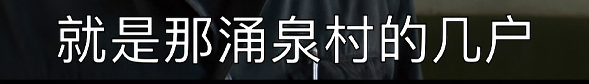

# Hardcoded Subtitles to SRT
Creates an
[SRT](https://www.matroska.org/technical/subtitles.html#srt-subtitles) file from
a video file that has hardcoded subtitles. For example,



will generate

```
57
00:03:20,200 --> 00:03:22,120
就是那涌泉村的几户
```

The script relies on [Tesseract](https://github.com/tesseract-ocr/tesseract) for
the optical character recognition.

## How to use
```
usage: hard_subs_to_srt.py [-h] video_file srt_file

Creates an SRT file from a video file that has hardcoded subtitles

positional arguments:
  video_file  the path to a video file that has hardcoded subtitles
  srt_file    where to put the resulting SRT file, will overwrite if
              it is already there
```